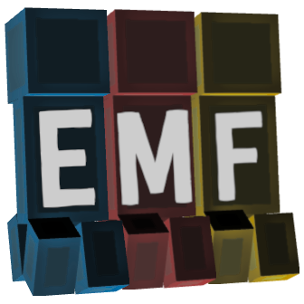

# Entity Model Features
 

Entity Model Features (EMF) is a Fabric, Quilt & Forge mod that adds support for OptiFine's Custom Entity Models (CEM). It's designed for anyone who wants to use the CEM resource pack features but also use mods such as Sodium, Continuity or ETF.

## Required Mods
Please also install the below mods if you can, the obvious ones such as Sodium are not mentioned.

It should also go without saying EMF is NOT compatible with dorianpb's CEM and OptiFabric.
#### Required
- [Entity Texture Features (ETF)](https://modrinth.com/mod/entitytexturefeatures): 
  EMF uses several features from my other mod ETF, so it is required. (primarily used to support the random model feature, the config screen, and allow textures set in models to vary like in OptiFine)

#### Highly recommended
- [Entity Culling](https://modrinth.com/mod/entityculling): This mod does wonders for reducing entity rendering lag, doing even more than Sodium's included entity culling. This is very beneficial when using animation heavy packs like Fresh Animations.

## Fresh Animations?
Yes.

it works :)

 

[Download Fresh Animations](https://www.planetminecraft.com/texture-pack/fresh-animations-v1-0/)

## Features & OptiFine differences & Known Bugs

Up-to-date feature details page : [Features & Optifine differences](FEATURES.md)

## FAQ

> **Q:** Do all OptiFine CEM resource packs work?

**A:** Most packs work fine, but I'm sure there are some exceptions, report any found issues [here](https://github.com/Traben-0/Entity_Model_Features/issues), or on my [discord](https://discord.com/invite/rURmwrzUcz).

> **Q:** What's different between EMF and dorianpb's [CEM](https://modrinth.com/mod/cem)?

**A:** EMF is in a complete state and has a nearly 1 to 1 parity with OptiFine CEM, EMF also does a few extra things like player animations and armor model support, with more ideas on the way :)

EMF also does things differently under the hood with little to no hardcoding of support for vanilla models. Allowing full CEM support for various modded entities.

> **Q:** Backports?

**A:** Backports to 1.18 & 1.19 are planned.
Backports to version 1.17 and below are not planned at this time.

## License

EMF is licensed under the [GNU Lesser Public License](LICENSE), version 3.0
